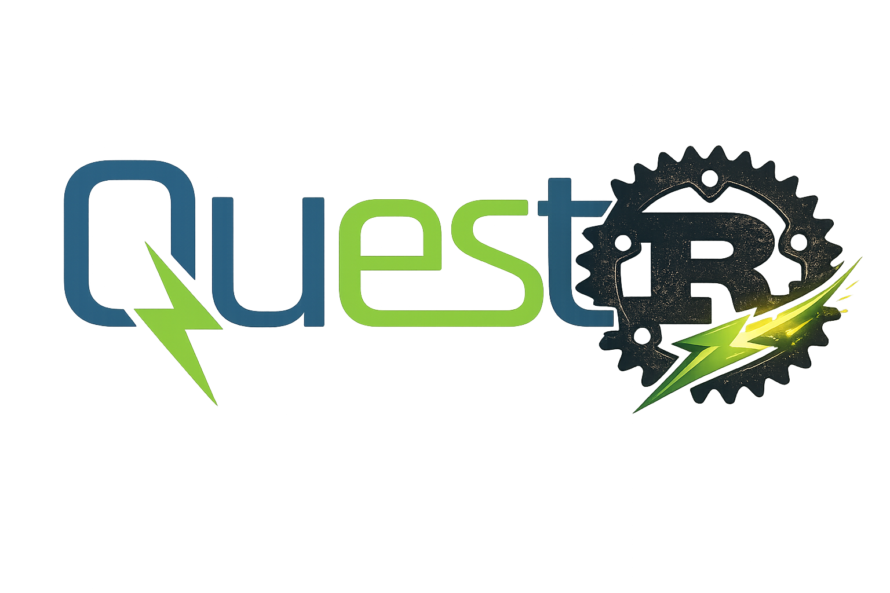

<div align="center">
    
</div>

# quest-bootstrap

Downloads Python, Git, and GLPK installers for your OS so QuESt prerequisites
are ready to install. No system admin rights needed — everything goes into a
per-user data directory.

## Usage

```bash
cargo run
```

The tool detects your OS and architecture, creates an app data directory, and
downloads the required installers into it.

### Where files go

| OS      | Default path                                    |
|---------|--------------------------------------------------|
| Linux   | `~/.local/share/quest-bootstrap/`               |
| macOS   | `~/Library/Application Support/quest-bootstrap/` |
| Windows | `%APPDATA%\Sandia\quest-bootstrap\`             |

## Downloads per platform

| Tool  | Windows                          | macOS                      | Linux                    |
|-------|-----------------------------------|----------------------------|--------------------------|
| Python| `.exe` installer                  | `.pkg` installer           | Source `.tgz`            |
| Git   | `.exe` installer                  | `.dmg` installer           | Source `.tar.gz`         |
| GLPK  | `.zip` (Windows GLPK)            | Source `.tar.gz`           | Source `.tar.gz`         |

After downloading, run each installer manually or use your system package
manager to install the tools.

### Linux quick install

```bash
sudo apt install python3 python3-pip git glpk-utils
```
